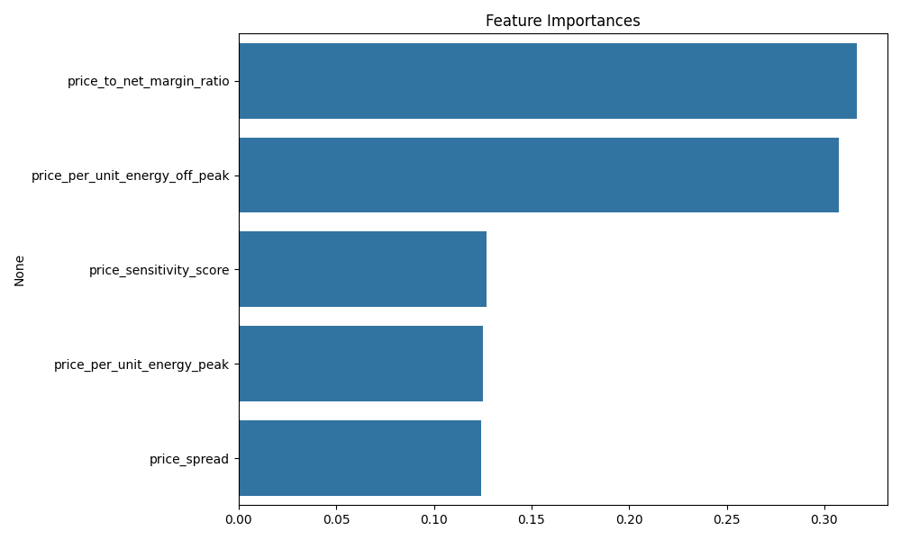

# 🔍 PowerCo Churn Analysis – BCG Virtual Internship Project (Forage)

Welcome to a real-world consulting simulation.

As part of the **BCG Data Science & Analytics Virtual Experience Program** hosted on [The Forage](https://www.theforage.com/), I stepped into the shoes of a BCG Data Scientist. My mission? Help a fictional energy client, **PowerCo**, understand **why customers are churning** — and determine whether **price sensitivity** is the key driver.

This project simulates a real client engagement where I worked independently with minimal guidance, structured my own analysis, and delivered insights backed by data.

---

## 🧠 The Problem

> "Is price sensitivity the main factor driving customer churn?"

PowerCo, a utilities provider, is concerned about rising customer churn. As the Data Scientist, I was provided:
- Historical customer usage and contract data
- Historical pricing data
- A churn label indicating whether a customer churned

My job was to:
1. Understand and explore the data
2. Engineer features related to pricing behavior
3. Build a churn prediction model
4. Determine if price sensitivity is the strongest signal

---

## 🏗️ Project Structure

```
powerco-churn-analysis/
│
├── data/                      # Input CSVs (client_data.csv, price_data.csv)
├── outputs/                   # Feature importance and plots
├── src/                       # Modular source code
│   ├── data_loader.py         # Load and validate datasets
│   ├── eda.py                 # Descriptive stats and distributions
│   ├── feature_engineering.py # Price-related feature generation
│   └── modeling.py            # Random Forest churn model + feature importances
├── main.py                    # Pipeline entry point
├── requirements.txt           # Python dependencies
└── README.md                  # You're here!
```

---

## 🔍 Exploratory Data Analysis (EDA)

Before building any model, I needed to understand the data:
- Data types and ranges
- Null value checks
- Basic statistics
- Distributions of numeric columns

Plots were saved in the `outputs/` folder for visibility and offline review.

---

## 🛠️ Feature Engineering: Price Sensitivity

To evaluate price sensitivity, I engineered features that represent the relationship between pricing and usage:

| Feature | Description |
|---------|-------------|
| `price_per_unit_energy_peak` | Cost per kWh (peak time) |
| `price_per_unit_energy_off_peak` | Cost per kWh (off-peak) |
| `price_spread` | Peak minus off-peak price |
| `price_to_net_margin_ratio` | Price cost compared to value |
| `price_sensitivity_score` | Composite score combining spread and per-unit pricing |

These features were designed to be intuitive, interpretable, and directly linked to customer cost behavior.

---

## 🤖 Modeling: Predicting Churn

I used a **Random Forest Classifier** as a baseline to predict churn based solely on price sensitivity features.

### ⚙️ Results:
```text
Accuracy: ~88%
AUC Score: 0.545 (baseline - unbalanced data)
```

> This initial model shows that **price sensitivity does play a role**, but it is not the dominant factor driving churn.

### 📊 Feature Importance Plot:


---

## 🚀 How to Run This Project

```bash
# Clone the repo
git clone https://github.com/tripathi-ayushi/powerco-churn-analysis.git
cd powerco-churn-analysis

# Create virtual environment
python -m venv venv
venv\Scripts\activate  # or source venv/bin/activate on Linux/Mac

# Install dependencies
pip install -r requirements.txt

# Add your data files to /data:
# - client_data.csv
# - price_data.csv

# Run the full pipeline
python main.py
```

---

## 📌 What I Learned

- How to scope a problem independently
- How to think like a consultant (translate business questions into data workflows)
- How to build a clean, modular ML pipeline in Python
- How to evaluate whether a hypothesis (price sensitivity) is backed by data

---

## 🧩 Next Steps

- Balance the data using class weights or SMOTE
- Add behavioral and contract-based features
- Try interpretable models (e.g. logistic regression)
- Use SHAP or permutation importance for explainability
- Turn this into a deployable microservice or dashboard

---

## 💼 About This Project

This project was completed as part of the **BCG Virtual Internship Program** on [The Forage](https://www.theforage.com). It simulates a real-world client scenario where independent thinking, problem-solving, and data storytelling are key.

---

## 👩‍💻 Author

**Ayushi Tripathi**  
ML Enthusiast  
[GitHub @tripathi-ayushi](https://github.com/tripathi-ayushi)

---

## 📜 License

This project is released under the MIT License.
